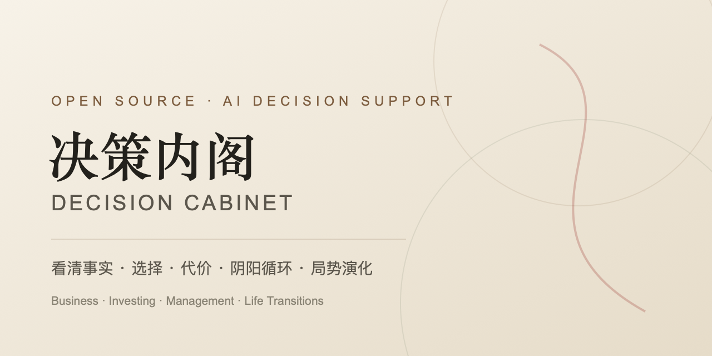

# Decision Cabinet · 决策内阁

[中文](README.md) · [English](README_EN.md)

[](https://github.com/joyozhang333-lgtm/decision-cabinet/actions/workflows/ci.yml)
[](https://github.com/joyozhang333-lgtm/decision-cabinet/actions/workflows/pages.yml)
[](LICENSE)
[](pyproject.toml)

Decision Cabinet is an open-source AI decision-support system and a four-round personal advisory board whose members respond to one another while the user participates.

It does not predict destiny, promise returns, or make decisions for you. It helps you see:

- verified facts, assumptions, unknowns, and evidence gaps;
- what each option gains and what it costs directly;
- opportunity costs, second-order effects, and irreversible commitments;
- opposing forces, feedback loops, and points where an advantage becomes a burden;
- baseline, upside, and downside scenarios with leading indicators;
- what only the decision-maker can ultimately choose.

> Core principle: face reality first. Examine facts, choices, and costs before projecting how the situation may evolve.

[Live Demo](https://joyozhang333-lgtm.github.io/decision-cabinet/demo/) · [English Product Page](https://joyozhang333-lgtm.github.io/decision-cabinet/en/) · [中文介绍](https://joyozhang333-lgtm.github.io/decision-cabinet/) · [Agent integrations](docs/INTEGRATIONS_EN.md) · [Contributing](CONTRIBUTING.md)



## Try the interactive demo

Open the [browser-based live demo](https://joyozhang333-lgtm.github.io/decision-cabinet/demo/). No account or API key is required.

The demo includes 28 public-method advisor perspectives and 23 traceable knowledge cards. You can clarify a decision, generate a decision map, complete a fixed four-round council, participate between rounds, close the session, record your own choice, and review the outcome later. Every round exposes its agenda, reply targets, stances, named positions, provisional conclusions, consensus, and dissent.

The demo uses built-in educational responses and does not call an external LLM. Its decision dossier and journal stay in the current tab's `sessionStorage`, are cleared when the tab closes, and can also be cleared from the banner. Run the full open-source application locally to connect DeepSeek, Claude, or an OpenAI-compatible provider.

## What it helps with

### Business and strategy

Product choices, pricing, customer value, growth, cash flow, capital allocation, brand, organization design, and team capacity. Decision Cabinet brings vision back to evidence, unit economics, constraints, and reversible experiments.

### Investing and stock analysis

Financial statements, valuation ranges, asset allocation, position sizing, liquidity, cycles, and investment-thesis review. Investment workflows require:

- a clear data-as-of date and links to primary disclosures;
- separation of facts, company guidance, market expectations, and inference;
- explicit valuation assumptions and disconfirming evidence;
- portfolio context, position limits, maximum tolerable loss, and exit conditions.

Decision Cabinet does not include real-time market data by default. Verify US filings through sources such as SEC EDGAR and Chinese disclosures through the relevant exchanges or CNINFO.

### Major life transitions

Career, city, relationships, responsibility, and long-term direction. The system does not impose a single value system. It helps you see what kind of life each option creates and what price that life requires.

## The decision process

```text
A real decision
  ↓
Clarify context: facts / numbers / goals / fears / constraints
  ↓
Decision map: options / gains / costs / second-order effects / reversibility
  ↓
Scenario evolution: baseline / upside / downside / signals / responses
  ↓
Traceable knowledge: methods + boundaries + sources
  ↓
Four-round council: fact boundaries → focused debate → stress test → conditional convergence
  ↓
User participation: answer / add facts / focus the dispute / listen to internal debate
  ↓
Facilitator close: preserve dissent and return authority to the user
  ↓
Decision journal: rationale, expectations, stop conditions, and review
```

## Knowledge base

The repository includes 23 traceable Markdown knowledge cards across five domains:

| Domain | Examples |
| --- | --- |
| Decision science | Decision quality, choice and cost, scenario evolution, yin-yang feedback cycles |
| Business | Customer value, unit economics, capital allocation |
| Finance | Financial statements, primary disclosures, valuation, margin of safety, portfolio risk, market cycles |
| Management | Effectiveness, incentives and governance, experiments, risk management |
| Chinese and world wisdom | *I Ching*, *Tao Te Ching*, *Analects*, *The Art of War*, dependent origination, Wang Yangming, and Kahlil Gibran's *The Prophet* |

Every card in `cabinet/resources/knowledge/` includes questions, methods, boundaries, sources, and tags. Modern copyrighted works are summarized rather than copied. Classical text and modern interpretation remain separate. See [Third-party content notice](THIRD_PARTY_CONTENT.md).

## Advisory council

The council combines fact-checking, business, investment, management, psychology, and classical-wisdom lenses. A person-based advisor is an interface to public methods and texts, not an authorized agent or a simulation of that person's real opinion.

The system enforces these boundaries:

- classical quotations come only from a reviewed allowlist;
- modern viewpoints are normally presented as method summaries, not fabricated quotations;
- meaningful disagreement is preserved instead of flattened into consensus;
- final decision authority always belongs to the user.

### A real four-round deliberation

Each round follows `agenda → advisor reply chain → round_summary`. Advisors do not submit isolated versions of the same answer. From the second speaker onward, each turn names another position and supports, challenges, or refines it. From round two onward, the turn must also add a new argument, counterexample, condition, or evidence request.

| Round | Job | Required visible result |
| --- | --- | --- |
| 1 · Fact boundaries | Separate facts, inferences, and unknowns; state testable opening positions | Named views, provisional conclusions, consensus, dissent |
| 2 · Focused debate | Turn dissent into specific issues and direct exchanges | Agenda, explicit sides, consensus, dissent |
| 3 · Stress test | Test costs, disconfirming evidence, second-order effects, and scenario evolution | Challenged assumptions, change signals, evidence gaps |
| 4 · Conditional convergence | State what to choose under which conditions while preserving the minority report | Conditional conclusion, action, stop conditions, dissent |

The engine checks a speaker's new turn against their prior turns. A highly repetitive answer is retried with an explicit novelty requirement; if it remains repetitive, that advisor abstains for the round instead of paraphrasing the same answer. Between rounds the user can `answer`, `add`, `focus`, or `listen`. Silence is never treated as consent.

## Local setup

Requirements: Python 3.11+ and Node.js 20.19+ or 22.12+.

```bash
git clone https://github.com/joyozhang333-lgtm/decision-cabinet.git
cd decision-cabinet

python3 -m venv .venv
source .venv/bin/activate
pip install -e '.[dev]'

cp .env.example .env
chmod 600 .env
# Add a DeepSeek key, or configure Claude / an OpenAI-compatible provider.

uvicorn cabinet.web_api:app --reload
```

In another terminal:

```bash
cd web
npm ci
npm run dev
```

Open `http://127.0.0.1:5173`.

## Codex, Claude Code, and other agent hosts

v0.4.0 includes a read-only, stateless MCP server for knowledge search, offline decision maps, advisor metadata, and the four-round protocol:

```bash
python3 -m pip install 'decision-cabinet[mcp] @ git+https://github.com/joyozhang333-lgtm/decision-cabinet.git@v0.4.0'
decision-cabinet-mcp
```

The default command starts the stdio server. For local Streamable HTTP, bind to loopback only:

```bash
decision-cabinet-mcp --transport streamable-http --host 127.0.0.1 --port 8765 --path /mcp
```

For a repository checkout, run `python3 -m pip install -e '.[mcp]'` at the repository root. The built-in HTTP server has no public authentication and rejects non-loopback binds.

The repository includes a Codex plugin, a Claude Code plugin, a DeepSeek Harness MCP Client preset, a Hugging Face Tiny Agents preset, and an OpenClaw MCP registry fragment for ML Claw runtimes. Tencent WorkBuddy requires users to deploy the loopback HTTP service on a reachable host and put their own authenticated HTTPS reverse proxy in front of it before registering a custom Connector. Adding a plugin marketplace does not install the Python runtime or MCP SDK.

- Codex: after installing the runtime above, run `codex plugin marketplace add joyozhang333-lgtm/decision-cabinet --ref v0.4.0` and `codex plugin add decision-cabinet@decision-cabinet`.
- Claude Code: `claude mcp add decision-cabinet -- decision-cabinet-mcp`.
- DeepSeek Harness remains a developer preview. A preset is included, but v0.4.0 does not claim a locally verified `dsh` end-to-end run.
- Hugging Face Tiny Agents uses `huggingface-agent.json`. If “Little Lobster” refers to Hugging Face's **ML Claw** repository, use the underlying OpenClaw runtime MCP registry and `mlclaw-openclaw.mcp.json` fragment.
- Tencent WorkBuddy is not CodeBuddy, the GitHub Pages demo is not a remote MCP backend, and v0.4.0 has not been verified end to end in a WorkBuddy enterprise environment.

See [Agent integrations](docs/INTEGRATIONS_EN.md) / [中文接入指南](docs/INTEGRATIONS.md) for commands, primary sources, authentication limits, and verification status.

## Privacy and security defaults

- `.env`, SQLite databases, virtual environments, and generated frontend assets are ignored by Git.
- The decision dossier and decision history are not sent to an external provider unless the user opts in for that round.
- Private UI APIs accept loopback clients by default, and browser access trusts only `localhost:5173` and `127.0.0.1:5173` unless configured otherwise. Remote access requires `CABINET_UI_API_KEY` plus the exact frontend origin in the comma-separated `CABINET_UI_ORIGINS` setting.
- The external API remains disabled unless `CABINET_EXTERNAL_API_KEY` is configured.
- User-provided context and model output are treated as untrusted data, not system instructions.
- Request sizes, transcript sizes, advisor counts, and concurrent streaming sessions are bounded.

## Architecture

```text
React / TypeScript
      ↓
FastAPI ── Decision map ── Local Markdown knowledge retrieval
   │              │
   │              └── Options / costs / second-order effects / scenarios
   ├── Four-round council ── agenda / reply chain / structured minutes
   ├── Read-only MCP server ── Codex / Claude Code / other MCP hosts
   ├── Advisor and source allowlists
   └── SQLite: dossier / sessions / decisions / reviews
```

See [Architecture](docs/ARCHITECTURE.md), [Product definition](docs/PRODUCT.md), [Agent integrations](docs/INTEGRATIONS_EN.md), and [Knowledge governance](docs/KNOWLEDGE-GOVERNANCE.md).

## Development

```bash
pytest -q
cd web && npm ci && npm run build
```

To reproduce the backend-free GitHub Pages demo:

```bash
python scripts/export_demo_data.py --output web/public/demo-data.json
cd web && npm run build:demo
```

CI runs the Python test suite on Python 3.11 and 3.12 and builds both the application and the static GitHub Pages demo.

## Important notice

Decision Cabinet is educational decision-support software. It is not investment advice, a securities recommendation, legal advice, medical advice, or tax advice, and it does not guarantee any outcome. Verify primary materials and consult appropriately licensed professionals for high-stakes decisions.

## License

[MIT](LICENSE) © Decision Cabinet contributors
